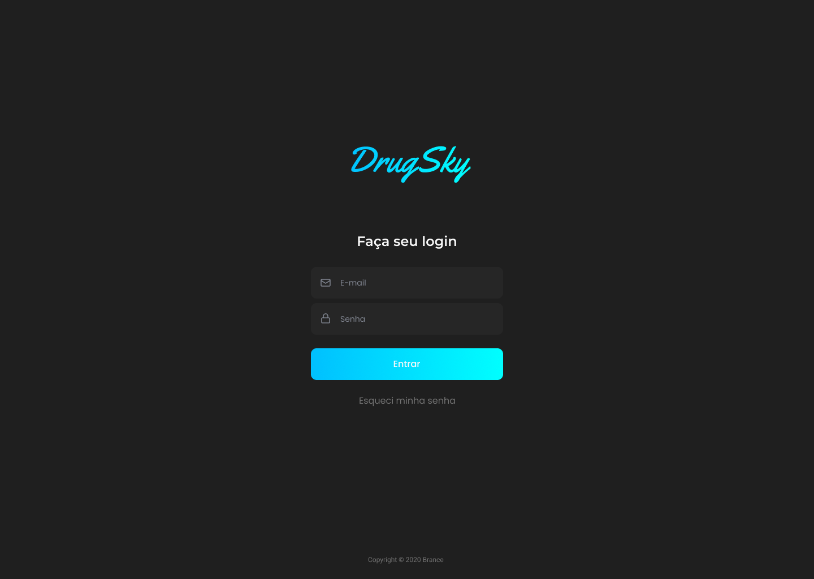
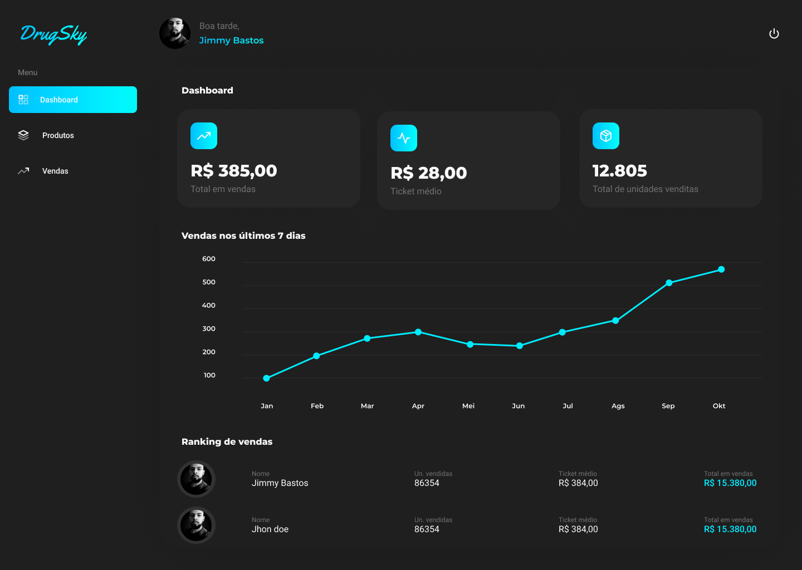
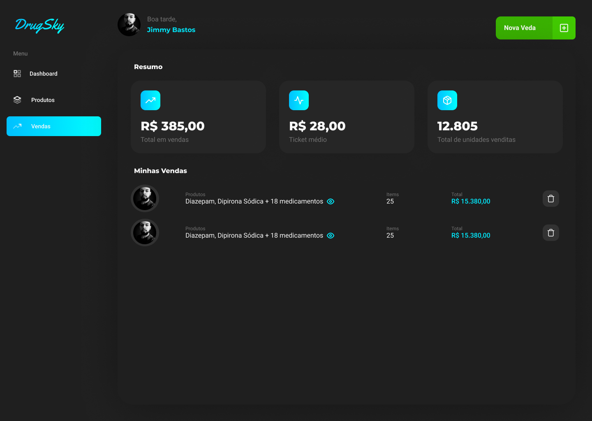
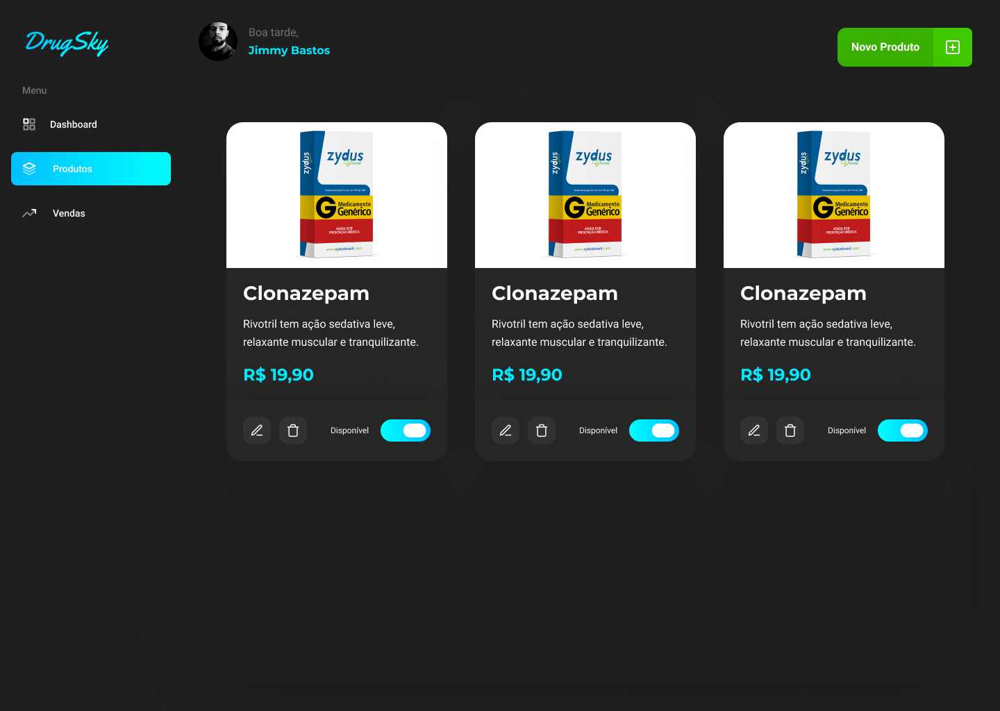

<h1 align="center">
  
</h1>

<h3 align="center">
  Uma simples plataforma de vendas de medicamentos desenvolvida com Vue.js
</h3>

# Índice

- [Screenshots](#screenshots)
- [Tutorial](#tutorial)
- [Stack](#tecnologias-utilizadas)
- [Configurando o Ambiente de Desenvolvimento](#como-usar)
- [Contribua](#como-contribuir)

## :heart_eyes: Screenshots
<details>
  <summary>
    Exibir layout
  </summary>
  
  
  
  
</details>

<a id="tecnologias-utilizadas"></a>

## :rocket: Stack

Esta aplicação foi desenolvida com as seguintes tecnologias:

- [Vue.js](https://vuejs.org/)
- [Vue Router](https://router.vuejs.org/)
- [Vuex](https://vuex.vuejs.org/)
- [Vuex Persited State](https://www.npmjs.com/package/vuex-persistedstate)
- [Highcharts Vue](https://github.com/highcharts/highcharts-vue)
- [Vue Modal](https://github.com/euvl/vue-js-modal)
- [Vue Notification](https://github.com/euvl/vue-notification)
- [Vue Feather Icons](https://www.npmjs.com/package/vue-feather-icons)
- [V-Money](https://github.com/vuejs-tips/v-money)
- [Yup](https://github.com/jquense/yup)
- [Axios](https://github.com/axios/axios)
- [Eslint](https://eslint.org/)


<a id="como-usar"></a>

## :fire:  Configurando o Ambiente de Desenvolvimento

- ### **Pré-requisitos**

  - É **necessário** possuir o **[Node.js](https://nodejs.org/en/)** instalado na máquina
  - Também, é **preciso** ter um gerenciador de pacotes, se você já tem o Node.js, então o NPM já vai estar disponível, mas aqui vou usar o **[Yarn](https://yarnpkg.com/)**.

1. Faça um clone :

```sh
  $ git clone https://github.com/JimmyBastos/bluesky-web.git
```

2. Executando a Aplicação:

```sh
  # Execute o comando abaixo para instalar as dependencias do projeto
  $ yarn

  # Inciciar o servidor de desenvolvimento
  $ yarn serve

  # E para inciciar a API
  $ cd server && yarn && yarn start
```

<a id="como-contribuir"></a>

## :heavy_check_mark: Como Contribuir

- Faça um Fork desse repositório

- Clone o repositório
```sh
  $ git clone https://github.com/<SEU_USUARIO_GIT>/bluesky-web.git
```
- Crie um branch com sua feature: `git checkout -b nome-da-feature`

- Comite suas mudanças: `git commit -m 'feat: Breve descrição da feature'`

- Envie a feature: `git push origin nome-da-feature`

## :computer: Author

<table>
  <tr>
    <td align="center">
      <a href="https://www.linkedin.com/in/jimmybastos/">
        
        <br />
        <sub>
          <b>@Jimmy Bastos</b>
        </sub>
       </a>
    </td>
  </tr>
</table>

## :check Todo
- [ ] Adicionar multiplos produtos à venda

## :memo:  License

Esse projeto está sob a licença MIT. Acesse o arquivo [LICENSE](LICENSE) para mais detalhes.
