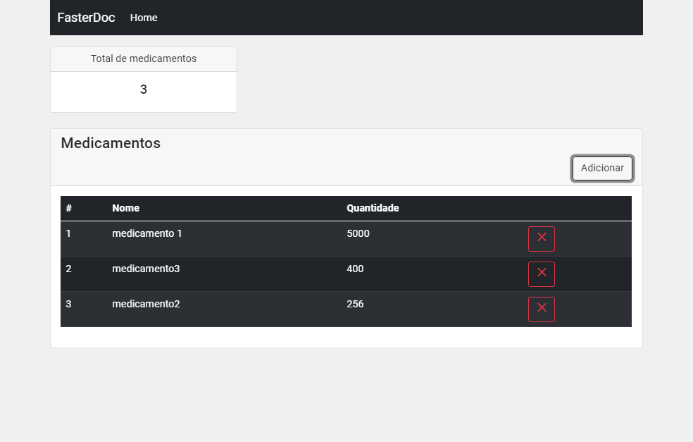

# FasterDoc

	FasterDoc is a challenge with focus on vue.

<h4 align="center"> 
	🚧  Working  🚧
</h4>

## Preview :desktop_computer:

<h1 align="center">
  
</h1>

## Features

- [x] Add drug 
- [x] Remove drug 
- [x] view drug
- [x] Sells Total 
- [x] Salesperson can see the drugs
- [x] Salesperson can add and remove sells
- [x] Response
- [x] Mobile first
- [ ] Update drug
- [ ] Data validation
- [ ] Medial ticket
- [ ] Units sold
- [ ] Graphic of sales
- [ ] Local Storage

### How it works

1. Open any browser (recommend Google Chrome)
2. Select any index.html inside the projects 
3. Done! 🚀

## Technologies Versions 🛠 

- HTML 5
- CSS 3
- Bootstrap 5
- ECMA 6
- Vue.js v2.6.12

## Questions & Answers 

Q: Why i use CDN?

A: I am not used to the vue ecosystem.

Q: Why this application don't have a local storage or any other methods?

A: Unfortunately at first I couldn't understand the method who storage functions, so I left it as a sercundary feature(I'll implement it in the next update).

Q: You have many css files, and some empty, why did you leave them even though you know there is nothing?

A: They're very useful, the css file separation makes maintenance much easier, but css was left as a secondary implementation.

Q: You left some important features, why?

A: I was trying to do as much as better, but those are harder for me, and i couldn't do it everything on time.
